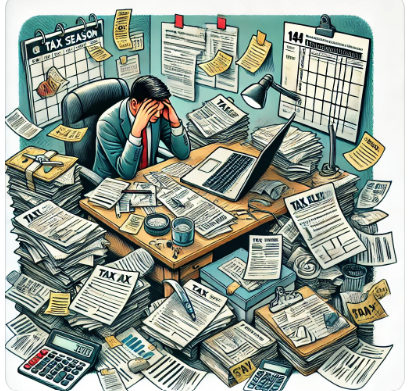

---
output:
  xaringan::moon_reader:
    lib_dir: libs
    nature:
      highlightStyle: github
      highlightLines: true
      countIncrementalSlides: false
    includes:
      #in_header: ../../../../../_Fns/packages4looks4rmd_beamer.tex
title: 'Supply and Demand'
author: "Abel Embaye"
date: "`r format(Sys.time(), '%B %d, %Y')`"
institute: |
  | Department of Economics
  |
  | UofA
  |
---

```{r setup, include=FALSE}
options(htmltools.dir.version = FALSE)
#knitr::knit_exit()
library(knitr)
library(kableExtra)
library(dplyr)
library(ggplot2)
library(cowplot)
#install.packages("ggpmisc")                         # Install & load ggpmisc package
library("ggpmisc")
#install.packages("patchwork")                       # Install & load patchwork
library("patchwork")
library(ggpmisc)
library(gridExtra)
library(grid)
library("ggdensity")
library(ggpubr)
library(scales)  # For dollar formatting
library(colorspace) # for darken()
library(ggrepel)    # for geom_text_repel()
```

> "Teach a parrot the terms 'supply and demand' and you've got an economist."--- Thomas Carlyle


##  Lesson Objectives 

In this chapter, you will be able to answer the following:

+  What factors affect buyers' demand for goods?

+  What factors affect sellers' supply of goods? 

+  How do supply and demand determine the price of a good and the quantity sold?  

+  How do changes in the factors that affect demand or supply affect the market price and quantity of a good?  

+  How do markets allocate resources?

---

## Markets and Competition 

+  A ***market*** is a group of buyers and sellers of a particular product. 

+  A ***competitive market*** is one with many buyers and sellers, each has a negligible effect on price. 

+  In a ***perfectly competitive*** market:
   1. All goods exactly the same
   2. Buyers & sellers so numerous that no one can affect market price – each is a ***"price taker"***

+  In this chapter, we assume markets are perfectly competitive.  

			
---

## Demand 

+  The ***quantity demanded*** of any good is the amount of the good that buyers are willing and able to purchase.


+  ***Law of demand:***  the claim that the quantity demanded of a good falls when the price of the good rises, other things equal. 

			
---
## The Demand Schedule and Demand Curve
```{r, echo=F, fig.width=15}
source("func_file.R")
y_val <- 1:6
x_val <- seq(14, 4, by=-2)
x_title = "Cups of Mocha per Month"
y_title = "Price in dollars"
draw_and_table(x_val , y_val , x_title , y_title  )
```

---
## Market Demand versus Individual Demand 

+ The quantity demanded in the market is the sum of the quantities demanded by all buyers at each price (horizontal summation).

+ Suppose Helen and Ken are the only two buyers in the Mocha market. (Qd = quantity demanded)

```{r, echo=F}
df<- data.frame(p=paste0("$",1:6,".00"),
                q1=seq(14,4,-2),q2=seq(7,2,-1), qm=seq(21,6,-3))
dt= df
x<- kable(dt, col.names=c("Price","Hellen's Qd","Ken's Qd", "Market Qd" ))%>% #escape = FALSE
row_spec(0:nrow(dt), bold = F, color = "black", background = "#b2ddb2")%>%
kable_styling(font_size = 20) #%>%
#column_spec(1:4, width = c("1in","1.5in", "1.5in"))

x

```
		

---
## The Market Demand Curve for Mochas 

```{r, echo=F, fig.width=15}
source("func_file.R")
y_val <- 1:6
x_val <- seq(21, 6, by=-3)
x_title = "Cups of Mocha per Month"
y_title = "Price in dollars"
draw_and_table(x_val , y_val , x_title , y_title  )
```
???
## What is the maximum price you would pay to get an A in the course ? $\diamond$ 

???


```{r, echo=F}
# Create a data frame with the table data
table_data <- data.frame(
  Price = c("$250", "100", "25", "10"),
  `Num. of students` = c("", "", "", ""),
  `Total Num. of students` = c("", "", "", "")
)

# Generate the HTML table using kable
kable(table_data, format = "html", table.attr = "style='width:50%;'") %>%
  kable_styling(bootstrap_options = c("striped", "hover", "condensed", "responsive"))
```

			
???

## Illustration: Confused Clerk $\diamond$

Suppose you are in store to buy shirt (s) and you encounter a confused clerk:

***You:*** “how much are these shirts

***Clerk:*** “\$20 each

***You:*** “I will take two .

***Clerk:*** “Sorry. I made a mistake. Those are really \$27 each

***You:*** “Alright. I will check another store to buy a shirt at utmost \$25.

--

???
While you are trying to exit the store he comes back to you …

***Clerk:*** “I am really sorry. They are \$27 shirts but they are on sale today for \$10.

***You:*** "Really???"  I will take three.''

Draw your demand schedule for shirt.

			
---

## Example: Market Demand for Gasoline 
```{r, echo=F, warning=F, message=F, fig.align='center'}	
grepl_plot()
```

---

## Demand Curve Shifters

+ The demand curve shows how price affects quantity demanded, other things being equal.

+ These "other things'' are non-price determinants of demand.  

+ Changes in them shift the D curve ...

NB: distinguish between **Change in quantity demanded** and  **Change in demand**

			
---

## Demand Curve Shifters: Terms

+  ***Change in quantity demanded*** refers to movt along the same demand curve and happens when the price of the good changes, other things constant.

+  ***Change in demand*** refers to shift of the entire demand curve and happens when the other things change (here quantity demanded is increasing or decreasing at each price).

			
---

## Demand Curve Shifters: 

*Mnemonic*: $PoYNTE$

1. \# of Buyers

2. Income of consumers (normal vs inferior)

3. Price of other goods: substitutes vs complements

4.  Taste

5.  Expectations (Consumers' belief about future price and income)

 

 

---

## **Active Learning: Mov't Along & Shift of D Curve**  

Draw a demand curve for music downloads.  What happens to it in each of the following scenarios?  Why?

.pull-left[a. The price of iPods falls 

b. The price of music downloads falls

c. The price of CDs falls
]

.pull-right[

]


---

## Supply 
 
+  The ***quantity supplied*** of any good is the amount that sellers are willing and able to sell. 

+  ***Law of supply:***  the claim that the quantity supplied of a good rises when the price of the good rises, other things equal  

---
## Starbucks' Supply Schedule & Curve   
```{r, echo=F, fig.width=15}
y_val <- 0:6
x_val <- seq(0, 18, by=3)
x_title = "Cups of Mocha per Month"
y_title = "Price in dollars"
draw_and_table(x_val , y_val , x_title , y_title  )
```
			
---

## From Individual Supply to Market Supply 

+  The $Q_s$  in the market is the sum of $Q_s$ by all sellers at each price. (Qs = quantity supplied)

+  Suppose Starbucks and Jitters are the only two sellers in this market.


```{r, echo=F}
p=paste0("$",0:6,".00")
q1=seq(0,18,3)
q2=seq(0,12,2)
plus=rep("+",length(p))
equalsn=rep("=",length(p))
qm=q1+q2
df<- data.frame(p, q1,plus,q2,equalsn, qm)
dt= df
x<- kable(dt, col.names=c("Price","Starbucks Qs","","Arsega's Qs","", "Market Qs" ))%>% #escape = FALSE
row_spec(0:nrow(dt), bold = F, color = "black", background = "#b2ddb2")%>%
kable_styling(font_size = 20) #%>%
#column_spec(1:4, width = c("1in","1.5in", "1.5in"))

x

```
		

---
## The Market Supply Curve
```{r, echo=F, fig.width=10}
y_val <- 0:6
x_val <- seq(0, 30, by=5)
x_title = "Cups of Mocha per Month"
y_title = "Price in dollars"
draw_and_table(x_val , y_val , x_title , y_title  )
```


???

## What is the minimum price at which you will be willing to shave your head? 

```{r, echo=F}
# Create a data frame with the table data
table_data <- data.frame(
  Price = c("$0", "25", "50", "50K"),
  `Num. of students` = c("", "", "", ""),
  `Total Num. of students` = c("", "", "", "")
)

# Generate the HTML table using kable
kable(table_data, format = "html", table.attr = "style='width:50%;'") %>%
  kable_styling(bootstrap_options = c("striped", "hover", "condensed", "responsive"))
```


---

## Supply Curve Shifters

+  The supply curve shows how price affects quantity supplied, other things being equal. 

+  These "other things" are non-price determinants of supply.  

+  Changes in them shift the S curve ...

+  Rightward shift of S curve is an increase in Supply; and Leftward is a decrease

			
---

## Supply Curve Shifters  

**Exercise**: Distinguish between *change in quantity supplied* and *change in supply*.

Supply increases (shift right) if:

1. Input prices: wages, prices of raw materials fall
2. Technology improves
3. \# of sellers increase
4. Expectation: Expected Future price of the good decreases 

***Mnemonics***: $NEIT$

---

## ***Active Learning***: SUPPLY  

.pull-left[
Draw a supply curve for tax return preparation software (such as TurboTax by Quicken).  What happens to it in each of the following scenarios?

a. The price of the software falls.

b. A technological advance allows the software to be produced at lower cost. 

]

.pull-right[

]

---

## Supply and Demand Together: Equilibrium Point, Price, Quantity


```{r, echo=F, warning=F, message=F}
# y=0:6; x=seq(24,6, -3); z= seq(0,30, 5)
# x_title="Q"; y_title="P"
# myfun <- function(xvar) {
#   #1 / (1 + exp(-xvar + 10))
#   8 - (xvar/3)
# }
# myfun2 <- function(xvar) {
#   xvar/5
# }
# # This sets the x range from 0 to 20
# gp<- ggplot(data.frame(x = c(0, 30)), aes(x = x)) +
#   stat_function(fun = myfun, geom = "line")+
#   stat_function(fun = myfun2, geom = "line")+
#   #scale_y_continuous(limits = c(0, NA)) + # Set the lower limit of y-axis to 0
#   theme(
#       axis.title.x = element_text(size = 20),  # Enlarge x-axis title
#       axis.title.y = element_text(size = 20),  # Enlarge y-axis title
#       axis.text.x = element_text(size = 25),   # Enlarge x-axis labels
#       axis.text.y = element_text(size = 25)    # Enlarge y-axis labels
#     ) +
#     labs(x = x_title, y = y_title) +  # Set custom axis titles
#     scale_x_continuous(breaks = x) +  # Set x-axis breaks to match data
#     scale_y_continuous(labels = label_dollar(accuracy = 0.01), limits = c(0, NA))  # Set y-axis labels to dollar format
#   
#   # Create the summary table
#   summary_table <- data.frame(
#     `P` = label_dollar(accuracy = 0.01)(y), # Dollar format for y
#     `Qd` = x,
#     `Qs` = z  # Dollar format for z
#   )
#   
#   # Create the table using ggtexttable with larger text
#   table_plot <- ggtexttable(summary_table, rows = NULL, theme = ttheme("mOrange", base_size = 40))
#   
#   # Arrange the line plot and table side by side
#   grid.arrange(gp, table_plot, ncol = 2, widths = c(2, 1))
```

			
---

##  Surplus (a.k.a. excess supply) 

When quantity supplied is greater than quantity demanded 


---

## Shortage (a.k.a. excess demand)

when quantity demanded is greater than quantity supplied 


---

## 3 Steps to Analyzing Changes in Eq'm   


---

## Example 1: Shift in Demand  


---

## Example 2: A Shift in Supply 


			
---

## EXAMPLE 3: A Shift in Both Supply and Demand  


---
background-image: url("imgs/Ch04_fig_BlankSS_DD.png")
background-position: 50% 95%
class: white
background-size: 75% 75%

## Effects of Supply and Demand Shifts  

<!--  -->

---

## ACTIVE LEARNING: MARKET ANALYSIS  

Use the three-step method to analyze the effects of each event on the equilibrium price and quantity of music downloads. 

+  ***Event A***:  	A fall in the price of CDs 
+  ***Event B***:  	Sellers of music downloads negotiate a reduction in the royalties they must pay for each song they sell.  
+  ***Event C***:  	Events A and B both occur.

---

## CONCLUSION: How Prices Allocate Resources 

+  One of the Core Principles from Chapter 1:  Markets are usually a good way to organize economic activity. 

+  In market economies, prices adjust to balance supply and demand.  These equilibrium prices are the signals that guide economic decisions and thereby allocate scarce resources.

+ The demand is determined Solely by buyers and the Supply by sellers, yet change in each (shift of the curve) affect quantity supplied or quantity demanded through changes in price because price a common variable that affects buyers and sellers.


```{r , echo=FALSE}
knitr::knit_exit()
```

## SUMMARY $\diamond$

+  A competitive market has many buyers and sellers, each of whom has little or no influence on the market price. 
+  Economists use the supply and demand model to analyze competitive markets.  

+  The downward-sloping demand curve reflects the Law of Demand, which states that the quantity buyers demand of a good depends negatively on the good’s price. 

???
## SUMMARY

+  Besides price, demand depends on buyers' incomes, tastes, expectations, the prices of substitutes and complements, and number of buyers.  If one of these factors changes, the D curve shifts. 

+  The upward-sloping supply curve reflects the Law of Supply, which states that the quantity sellers supply depends positively on the good's price. 

+  Other determinants of supply include input prices, technology, expectations, and the \# of sellers.  Changes in these factors shift the S curve.
  

			
---

## SUMMARY $\diamond$ 
 
+  The intersection of S and D curves determines the market equilibrium.  At the equilibrium price, quantity supplied equals quantity demanded.  

+  If the market price is above equilibrium, a surplus results, which causes the price to fall.  If the market price is below equilibrium, a shortage results, causing the price to rise.

---

## SUMMARY $\diamond$ 

+   We can use the supply-demand diagram to analyze the effects of any event on a market: First, determine whether the event shifts one or both curves.  Second, determine the direction of the shifts.  Third, compare the new equilibrium to the initial one.  

+  In market economies, prices are the signals that guide economic decisions and allocate scarce resources. 

			
---

## Extra Credit: Critical Thinking $\diamond$ 

+   What two problems do you think are most important about the parking situation on campus?

+   What policies could the administration make to resolve these problems?

+   Who needs parking the most?

+   Who would pay the most for parking?

+   Use a supply-and-demand graph to analyze this problem. 

+   How would your policy proposals affect the market for parking?

			
---

## Additional Exercises $\diamond$ 

Explain each of the following statements using supply-and-demand diagrams (draw only the market for the good in question).

+ "When a cold snap hits Florida, the price of orange juice rises in supermarkets throughout the country."

+  "When a war breaks out in the Middle East, the price of gasoline rises, and the price of a used Cadillac falls."

			
---

## Additional Exercises $\diamond$ 
Identify the flaw in this analysis: 

\bigskip
\begin{center}
"If more Americans go on a low-carb diet, the demand for bread will fall. The decrease in the demand for bread will cause the price of bread to fall. The lower price, however, will then increase the demand. In the new equilibrium, Americans might end up consuming more bread than they did initially."
\end{center}

---

## Hands On Exercise $\diamond$

 
Use the three-step method to analyze the effects of each event on the equilibrium price and quantity of music downloads. 

+  ***Event A:***  	A fall in the price of CDs

+   ***Event B:***  	Sellers of music downloads negotiate a reduction in the royalties they must pay for each song they sell.

+   ***Event C:***  	Events A and B both occur.

			


